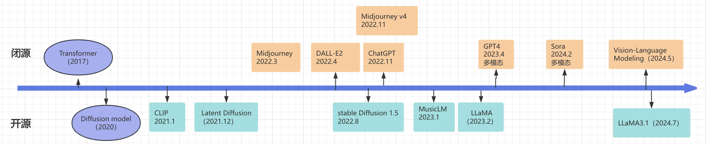
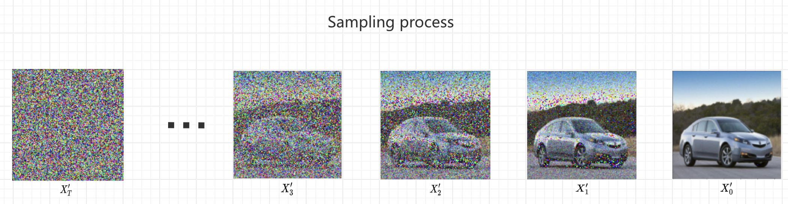
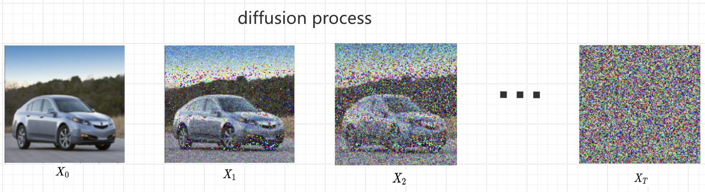
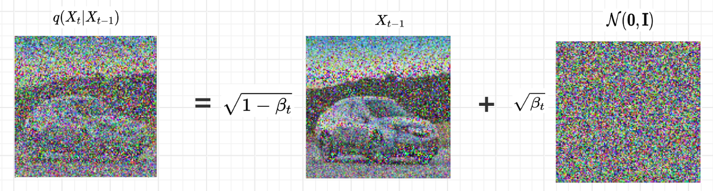
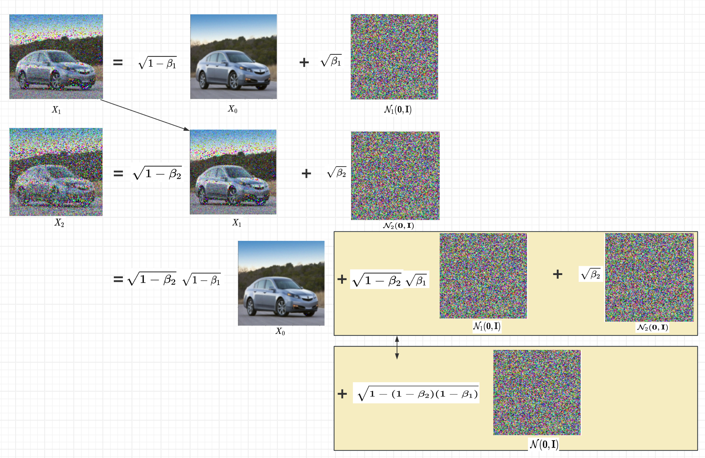
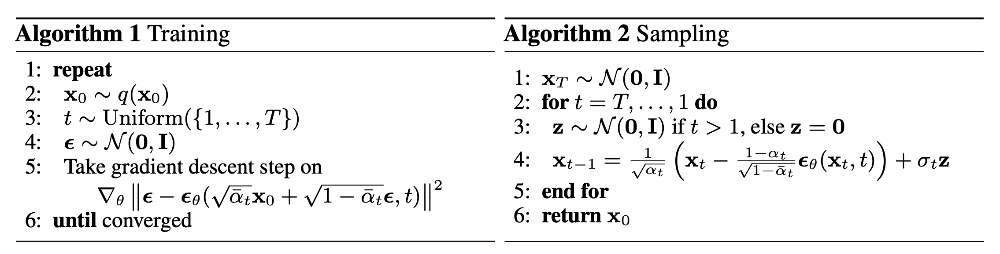
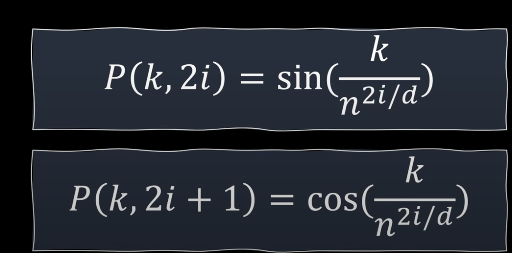
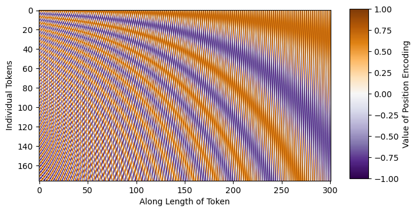
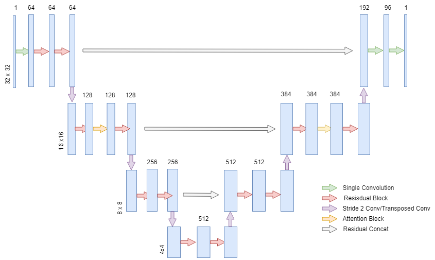

# Diffusion model实例浅析

在2022年，midjourney、DALL-E以及Stable Diffusion三个文生图模型引爆了机器生产文生图领域，他们的模型能够在可控条件（标签、文本描述）下生成高分辨率、细节丰富的多样性图像，这在视觉上往往难以与真实图像区分。

以下是他们几个简单的效果对比图。

学术和工业界对他们采用的 Diffusion 模型兴趣迅速增长，导致了大量的研究、改进和创新。这推动了技术的发展和成熟，进一步扩大了它们的应用范围和影响力。

本篇文章通过一个汽车图片生成的无条件Diffusion模型阐述这一原理。

本篇所述的Diffusion模型基于2020年12月的论文《Denoising Diffusion Probabilistic Models》，其是比较基础无条件的Diffusion 模型，简称为DDPM模型。

其生成图片是从一个高斯白噪声图片，一步一步去噪，通常可能要100~1000步以获得高质量、细节丰富的图片，其过程如下。

## Diffusion生成图的过程

上面gif动图显示的是图像生成过程，下面是一组静态图，首先$X'_T$是一个纯高斯白噪声图片，然后逐步去噪，直到$X'_0$（逼近原始数据集效果的图片），这里的$X'_0$并不是原始训练集里图片。

生成的过程是一步步去噪，每一步只去一点点，那么问题来了，如何估计每一步噪声量呢？使用Diffusion模型来估计，所以Diffusion模型输入应该是前一步的带噪图片$X_{t-1}$以及所在步数$t \in {1,...T}$，然后模型算出噪声$\epsilon_{\theta}$，这样就可以得到噪声稍微少一点的图片$X_t=X_{t-1}-\epsilon_{\theta}$了，迭代去做，直到得到$X'_0$基本和训练集差不多。

这里有一个问题需要解决，就是上面提到的模型算出噪声$\epsilon_{\theta}$，模型好理解，MLP、CNN、RNN、Transformer、Diffusion等，不论使用哪个模型，如何得到模型的参数集$\theta$（又称权重）呢？$\theta$表示的可能有几千万~几十亿的参数量，即几十亿个float值。要同时调节这几十亿个float值以使每一步的$\epsilon_{\theta}$逼近真实的情况，显然乱试是不可能的。

这样好了，我们先针对不同的$t$对图片加噪声，然后将带噪声的图片和时间$t$送入模型，让模型预测我们所加的噪声值，根据模型预测的噪声和实际所加的噪声的差距来调节模型的参数，只要数据量和样本足够多，理论上参数集$\theta$里的参数就可以调整到符合生成逼真图片的要求。权重参数收敛的过程使用的是梯度下降法，梯度下降法在信号处理领域早就使用了。

接下来的问题是，如何生成带噪的图片呢？这个过程在DDPM里称为Diffusion process，这里的$X_0$没有上标，这是因为这个图片是来自数据集里的，是模型训练之前就存在的图片。然后一步步加噪得到$X_T$，这里的$X_1$和Sampling的$X'_1$在时间上是相同的，但是因为噪声是随机的，所以两张图片并不完全相同，但是噪声量的差不多的。

通过这个过程，对每一个图片都可以生成一系列的带噪图片，每一个时间$t \in {1,2,\cdots,T}$所加的噪声量由噪声调度器控制（noise schedule），原paper是t越大加的噪声越多，到T的时候$\mathbf x_T$和随机生成的噪声是没有差别的。

但是这里有一个问题，就是在训练模型的时候，并不是按照$X_1,X_2,\cdots,X_T$的顺序给模型的，$t$是随机的，所以假如$t=8$，要生成$X_8$，我们需要生成$X_1, X_2,\cdots,X_7$，显然这样生成训练所需要的带噪图片效率太低了，这会浪费大量的算力。

从$t-1$时刻加噪得到$t$时刻带噪图片的计算如下：
$$
q(\mathbf x_t|\mathbf x_{t-1}) = N(\mathbf x_t;\sqrt{1-\beta_t}\mathbf x_{t-1}; \beta_t I), \forall t \in {1, \cdots,T}
$$
$（X_t|X_{t-1}）$表示从$t-1$时刻图片$X_{t-1}$得到t时刻图片$X_t$，q表示后验概率，即观察到$X_t$时，输入是$X_{t-1}$的概率，$\beta_t$是超参数，事先定义好的，公式1对应的图片表示如下：

从时刻0到时刻T的这一加噪过程，称为noise schedule，噪声就是独立同分布的高斯白噪声，只需要均值和方差这两个值就可以确定一个高斯分布（也称正态分布，确实比较简单，还有拉普拉斯、泊松分布、狄拉克分布等等），在Diffusion模型中更简单只使用了方差$\beta$这一个参数（因为均值是0）。

上面的步骤可以生成任意时刻的带噪图片，但是效率有些低，有没有办法一次性生成任意时刻的图片，而不用迭代呢？这样效率会高很多，根据公式1，即从$x_0$可以生成$x_1$，从$x_1$再生成$x_2$，通过一步步迭代计算$q(x_t|x_0)$，看看有没有规律。

从上面的图示可以看到，可以从$X_0$一步生成$X_2$，那按照递推公式应该是可以一步生成$X_t$，这里不再详细推导，感兴趣可以自行推导，这里直接给出公式：

$$
X_t=\sqrt{\overline \alpha_t}X_0 + \sqrt{1-\overline \alpha_t}\epsilon
$$
$\alpha_t$，$\overline \alpha_t$以及$\beta_t$三者之间的关系。

$\alpha_t=1-\beta_t$

$\overline \alpha_t=\alpha_1 \alpha_2\cdots\alpha_t$

前面说了，$\beta_t$是noise schedule的参数，通常T选择比较大，如1000，然后就可以确定所有的$\beta$,然后$\alpha_t$，$\overline \alpha_t$也就确定了。

到这里，我们已经了解了Diffusion生成图片的过程，以及训练时，带噪图片是怎么生成的了。接下来结合paper上的公式讲一下算法。

## 训练和推理 

paper给出的两个公式如下，traning使用的Diffusion一次生成带噪图片，Sampling就是应用的时候生成图片。

## Algorithm 1 训练过程

### Training算法过程，

首先这个是一个大的循序，直到模型收敛之后才会停止，收敛的标准就是训练时步骤5~6loss为判断依据。

第二行：$\mathbf x_0$是一个干净的图，就是训练集中的图

第三行：从{1,T}中选择一个值，通常T是一个比较大的值，比如1000，为了训练方便，这里选择了300

第四步：首先$N(0,I)$是一个标准正态分布，其均值是0，标准差是1，这一步是计算一个和汽车图大小一样的噪声图片，是对每一个像素（RGB）加随机一个标准正态分布的噪声，这种生成的噪声图被称为独立同分布的，没有考虑像素点之间的关系，但是效果好且简单，所以一直都是用的独立同分布的噪声。

第五步：$\sqrt{\overline \alpha_t} \mathbf x_0 + \sqrt{1-{\overline \alpha_t}}\mathbf {\epsilon} $，该式表示将训练集中的图$\mathbf x_0$，和图片尺寸大小相等的噪声$\mathbf \epsilon$做一个weighted sum，这里的weight是事先已经定好的${\overline {\alpha}_1,\overline {\alpha}_2, \cdots, \overline {\alpha}_T}$，当第三步中的t取哪个值，这里的$\overline {\alpha}$就取哪一个，通常$\overline {\alpha}_t$取值随着t的增加而减少，即t越大加的噪声就越多，权重相加之后，得到的是带噪图片，

$\mathbf \epsilon_{\theta}(\sqrt{\overline \alpha_t} \mathbf x_0 + \sqrt{1-{\overline \alpha_t}}\mathbf {\epsilon} ,t)$，这是噪声预测器（就是Diffusion模型），即给定带噪图片和该时刻时间值，预测图片加的噪声是多少，很明显理想情况下模型预测的就是t时刻加的噪声$\mathbf {\epsilon}$，但是由于模型参数一开始是随机的，所以预测值和真实值之间必然存在差异，所以就用这个差异来做为loss的基准，直到误差足够小，即图中的converged条件满足。

### Sampling算法过程：

因为是从纯噪图片里面生成图片，所以每一步都是一个去噪的过程，一步步迭代去减掉噪声。

那噪声是多少呢？这个是Diffusion model做的事，Diffusion model去预测噪声，

1.首先生成一个独立同分布的噪声$\mathbf x_T$

2.2~5这几行是一个T次的循环，循环的目的是逐步去噪声，第三行是再次生成一个独立同分布的噪声$\mathbf z$，作用后面再讲。

$\mathbf x_t$是上一步生产的图，对于第一步就是$\mathbf x_T$，$\mathbf \epsilon_{\theta}(\mathbf x_t, t)$，这步就是调用前面训练得到的Diffusion模型根据上一步产生的图和t预测图片的噪声

## 背后的数学原理

对于一个训练好的模型(一般用$\theta$）表示其参数集，其得到一张训练集中的图片的概率可以表示成如下公式：
$$
P_{\theta}(x_0)= \int \limits_{x_1:x_T}P(x_T)P_{\theta}(x_{T-1}|x_T)\cdots P_{\theta}(x_{t-1}|x_t)\cdots P_{\theta}(x_{0}|x_1)dx_1:x_T
$$
模型最优的参数应该是使得所有图片的概率最高，这样得到的模型输出的分布最接近原始数据集的分布，这可以表示为：
$\theta^*=\arg \max \limits_{\theta}\prod_{i=1}^mP_{\theta}(x^i)$=$\arg \max \limits_{\theta}\log\prod_{i=1}^mP_{\theta}(x^i)$=$arg \max \limits_{\theta}\sum_{i=1}^m \log P_{\theta}(x^i)$

$q(x_1|x_0)$表示在有原图时，得到第一步带噪图片$x_1$的概率，则一直加噪得到带噪$x_T$图的概率可以表示为$q(x_1:x_T|x_0)$，这也是加噪过程，其表达的式是：$q(x_1:x_T|x_0)=q(x_1|x_0)q(x_2|x_1)\cdots q(x_T|x_{T-1})$

## 噪声$\sigma_t \mathbf z$作用

$\sigma_t \mathbf z$前面说了sampling的过程实际是去噪声的过程，Diffusion model就是预测噪声用的，为什么这里反而要额外加一个微小的噪声呢？这是因为每一步模型生成的都是概率最高的噪声，经过一步步的迭代强化之后，得到最终会是概率最高的唯一图片，从大语言模型的最后的temp值就是控制生成过程的随机性。对于一句话，如果每一个字的概率都是最高的，反而是不好的，比如这一段的内容，并不是每一个字的概率都是最高的。

## 模型中的t

positional Embedding

## UNet

Diffusion模型结够采用UNet结构，主要是CNN算子

模型细节这里不展开了，在代码实例中再展开。

**欢迎大家点赞、关注以便及时收到更新提醒。**

接下来看简单的例子，后续在这个简单例子上继续深入，包括

- 自己的数据集怎么处理
- 多GPU训练
- 标签、文本控制图片生成
- 图片修复
- 以及开源比较火的Stable Diffusion 1.5/3
- 模型的部署推理等

下一篇还是先看代码和实例，代码可以完全在CPU上训练，这意味着即使没有GPU，也可以跑代码理清里面的原理，但训练的时间上会比较长。
